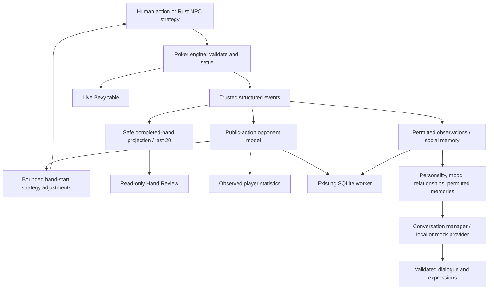

# Poker Lab v1.0 verification report

Stage 8, October 9, 2026. Audited the clean local `main` checkout at `7a11901`,
following `15e7ad2` and the LM Studio fix at `d108123`. The baseline was 113 passing
tests. The package is now **1.0.0**, with the existing pinned dependencies.
The user approved marking this version as v1.0. Outstanding manual checks below
remain unverified; the version change does not turn them into passing results.

Final version verification after adding the main-menu Exit button: `cargo fmt
--check`, `cargo clippy --all-targets -- -D warnings`, `cargo test` (107 library
and 14 application tests, 121 total), and `cargo build` all passed. The Exit
button uses Bevy's normal shutdown message and existing save handling.

## Implementation and boundaries

Added a bounded, read-only Hand Review and a small player Statistics view.
Preserved poker rules, all three base/adaptive personalities, conversation prompts,
provider selection, social state and SQLite schema 4. The existing long-chat
layout remains intact. New views use the current Bevy UI and visual palette.

The LLM has no action or relationship mutation interface. Review and statistics
never send events back into the engine, opponent collector or social memory.

### Files changed

- `src/review.rs`, `src/review/tests.rs`: safe event projection, bounded history,
  index navigation and accounting/privacy tests.
- `src/statistics.rs`: formatting and tests for the existing opponent counters.
- `src/game/mod.rs`: feeds the projection once alongside existing event consumers.
- `src/ui/review.rs`: Hand Review / Statistics modal, boundary controls and cached text.
- `src/ui/mod.rs`, `src/ui/controls.rs`: modal input guards, paused NPC application,
  reset handling and an integration test for read-only navigation/return.
- `src/ui/table.rs`: two entry buttons using the existing table layout.
- `src/lib.rs`: exports the new independent view modules.
- `examples/ui_smoke.rs`: review steps, final awards, statistics, pause and geometry checks.
- `Cargo.toml`, `Cargo.lock`: application version only; no dependency changes.
- `README.md`, this report: user instructions and release evidence.

## Replay design

The trusted host reduces each new authoritative event into an owned visible frame.
Initial stacks and blinds come from HandStarted/BlindPosted. PlayerActed supplies
actual post-action stacks, pot, payment and street total. CommunityCardsDealt adds
only that street's cards. Refund and award events update displayed accounting;
the final Outcome supplies authoritative main/side-pot shares, including odd chips.
There is no second betting engine, evaluator, random redeal or outcome inference.

Only human CardsDealt is retained. Opponent CardsDealt, burns and shuffle seeds
are discarded. ShowdownStarted contains only public reveals; these become visible
at that exact frame, including legitimate preflop all-in reveals. Folded/unshown
opponent cards remain absent. A pending hand is private to the converter and is
not published until HandCompleted. Replaying a completed hand during another live
hand therefore cannot inspect the new hand's hidden events.

The last 20 completed hands are kept in the current match. A defensive limit of
4,096 frames rejects an exceptional overlong hand entirely. New Match or leaving
the table releases the reviews. Poker waits while review/statistics are open;
an existing strategy worker may finish, but its result is not applied until return
and still must match the original session/turn token. No new background worker,
database or model request is involved. Optional pot-odds analysis and extra model
commentary were omitted to keep review factual and compact.

Tests cover initial stacks/blinds, action ordering, staged board visibility,
chip conservation per frame, refunds, side pots, tied/odd-chip awards, public-only
reveals, secret-event mutation invariance, incomplete-hand exclusion, history and
navigation bounds, duplicate completion, live-state isolation and resumed play.

## Statistics

This view formats `LearningUi.model` and never collects its own observations.
It displays raw lifetime `successes / opportunities`, not smoothed strategy estimates.
No opportunities produces no rate; fewer than 30 opportunities is labelled a small
sample. That label is a caution, not a calibrated confidence interval.

| Metric | Numerator / denominator |
| --- | --- |
| Hands | Completed hands dealt to the human |
| VPIP | Voluntary preflop chip-payment hands / hands with a preflop decision |
| PFR | Hands increasing the preflop wager / same decision-hand denominator |
| 3-bet | Reraises / first legal human opportunity facing one preflop raise |
| Fold to 3-bet | Folds / original opener facing the second preflop increase |
| Continuation bet | Flop bets / unbet flop opportunities as last preflop raiser |
| Fold to c-bet | Folds / first response to the unraised continuation bet |
| River aggression | Wager increases / river decisions with legal raising rights |
| Went to showdown | Public showdowns / hands reaching the flop without folding |
| Won showdown share | Any award / public showdowns; ties/side-pot shares count |

The [Stage 7 metric contract](stage7-verification.md#exact-metrics) remains the
authority for exclusions and opportunity details. Bluff frequency is not invented
from hidden hands. Statistics tests check exact displayed counts and no-data cases;
existing persistence/reset tests and the two-process GUI run cover restoration
and separation from social data.

## Conversation verification

Initially the local server was off and no model was loaded. Started the existing
LM Studio server on loopback and loaded the already-installed
`google/gemma-4-12b-qat` with an 8,192-token context. No download or remote key.

- Mock `social_probe`: **0 model / 39 scripted / 0 fallbacks**. This validates plumbing.
- `social_probe --require-model`: **39 model / 0 scripted / 0 fallbacks**, no silent,
  missing or stale responses. These were real HTTP completions with validated JSON,
  speaker, expression and length. Requests in the reviewed transcript took about
  3.6–5.6 seconds, within the configured 60-second deadline.
- `ui_smoke --small --local`: passed; **one model reply / zero fallbacks**, with the
  connected label checked through the actual Bevy input/presentation path.

The probe covers greetings, wellbeing, invitations, compliments, criticism,
apology, music, recent jazz recall, fatigue, and missing previous-day context for
all three NPCs. Examples from this run:

- Ananya on music: “I do. I find that certain types of music help with focus,
  though I prefer anything that isn't too distracting while I'm thinking.”
- Freya on work fatigue: “Of course, I hear you. Work can be a total drain.
  Tell me about it—what's been keeping you so busy today?”
- Yuna on yesterday: “I'm afraid I don't recall anything happening yesterday.
  I'm not sure what you're referring to.”

Quality is not perfect: Ananya redirected an invitation/compliment toward poker
and speculated that missing yesterday memories might be a dream. Some replies
remain overly formal. This is recorded as model grounding/style variation, not
misrepresented as perfect conversational quality. Prompts/providers were not
rewritten for Stage 8. Mock/fallback provenance remains visible. Live tests use
isolated memory, so they do not establish nuanced recall of the user's real history.

## Actual verification

| Command/check | Result |
| --- | --- |
| Baseline `cargo test` | Passed: 113 tests |
| Final `cargo fmt --check` | Passed |
| `cargo clippy --all-targets -- -D warnings` | Passed |
| Final `cargo test` | Passed: **120** (107 library + 13 application), zero failures |
| `cargo build` | Passed |
| `cargo build --release` | Passed; optimized executable built |
| `git diff --check` | Passed |
| `cargo run --example batch -- 100 42 96 10000` | Passed: 100 completed / 0 capped matches; 15,906 hands |
| `cargo run --example adaptive -- 2000 42 32` | Passed: five 2,000-hand batches including a style switch |
| `cargo run --example social_probe` | Passed with labelled mock output |
| `cargo run --example social_probe -- --require-model` | Passed: 39 generated / 0 fallback |
| `ui_smoke --small --long-chat` | Passed; real rendering and pointer-hit testing |
| `ui_smoke --hd --long-chat --restored` | Passed with the first run's isolated database |
| `ui_smoke --qhd --long-chat` | Passed at compositor-adjusted size, not exact QHD |
| `ui_smoke --small --local` | Passed with real model dialogue |
| Direct release executable startup | Vulkan/window initialized with repository assets; intentionally stopped after 8 seconds (timeout exit 124), not a full manual playtest |

Rendered sizes in the completed Stage 8 runs:

| Request | Actual logical | Actual physical |
| --- | --- | --- |
| Small | 1000×820 | 1250×1025 (125% scaling) |
| HD | 1920×1052 | 1920×1052 |
| QHD | 1920×1052 | 1920×1052 |
| Small/live | 1000×820 | 1000×820 |

The window manager constrained the HD/QHD requests. **Exact 1920×1080 and
2560×1440 were not verified in Stage 8.** Earlier layout checks are separately
documented; they are not substituted for current exact-resolution evidence.
Screenshots were inspected for long chat/input, review start/result and statistics.
The smoke harness checks glyph bounds, latest-line visibility, control separation,
review boundary buttons, pause, final pot awards, statistics matching the model,
betting, next hand, reset and return to menu. Injected malformed replies in long-chat
mode deliberately produce a fallback badge; these are not live-model failures.

The isolated database at `/tmp/poker-lab-v1-eHyoUZ/save.db` was reused across two
separate app processes: social sessions/preferences and at least two learned hands
restored. Automated tests also cover transaction rollback, unavailable storage,
private-memory isolation, relationship bounds and independent strategy resets.
No real player database was reset. Temporary runtime logs may disappear when the
execution environment restarts; the observed results above are retained here.

Simulation observations: against the overfolder, first adaptations appeared at
hands Ananya **35**, Freya **13**, Yuna **63**; against the calling station at
**35 / 14 / 64**. Against the loose-aggressive profile: **33 / 14 / 61**.
All use existing bounded modifiers and distinct baseline profiles. The batch run
showed VPIP Ananya 17.6%, Freya 37.1%, Yuna 15.7%; aggression 17.4%, 23.9%, 9.2%.
These demonstrate differentiated behavior, not evidence of optimal strategy or a
conclusive strength ranking.

## Stability and performance findings

The audit and existing tests found no release-blocking regression in engine
accounting, turn order, minimum/short raises, elimination, worker epochs, memory
privacy or dialogue transport. The model outage at the start was an unloaded local
service; explicitly loading the installed model restored inference.

A new integration test initially failed because a button interaction skipped while
the review modal was open could execute after closing. Fixed by continuing to consume
button changes while guarding their effects. The test now proves a synthetic Menu
click behind the modal cannot leave the game later. Intermediate Clippy complaints
about Bevy system signatures were resolved; no failing final checks remain.

Review construction runs only on new events and retains bounded frames. New overlay
text is cached until selection, session or completed-hand count changes. No per-frame
SQLite query, extra Monte Carlo simulation or model call was added. Existing strategy,
memory and dialogue workers remain independent. No frame-time benchmark or extended
memory soak was performed, so no numerical FPS/memory-performance claim is made.

## Readiness checklist

“Passed” below cites automated or inspected evidence; it does not stand in for an
unperformed human playtest.

| # | Definition-of-done requirement | Status / evidence |
| --- | --- | --- |
| 1 | Complete poker match without known serious rule problems | **Passed**: rule/property tests, full UI match tests, 100-match simulation |
| 2 | Distinct visual/conversational cast | **Passed**: portrait checks, unchanged profiles, real transcripts |
| 3 | LM Studio conversation | **Passed**: 39 real probe replies and live GUI reply |
| 4 | Offline poker/fallback | **Passed**: mock GUI, provider failure tests, visible fallback |
| 5 | Persistent memory/relationships | **Passed**: repository and two-process restoration checks |
| 6 | Adaptive poker | **Passed**: tests and 10,000 synthetic hands |
| 7 | Poker/social separation | **Passed**: unchanged boundaries and isolation tests |
| 8 | Polished, consistent experience | **Not tested** as final human acceptance; screenshots and GUI geometry passed |
| 9 | Readable long replies | **Passed**: 360-character glyph/scroll checks |
| 10 | Chat/betting input separation | **Passed**: existing integration and GUI checks |
| 11 | Accurate completed-hand replay | **Passed**: frame/accounting tests and rendered navigation |
| 12 | Hidden-card protection in replay | **Passed**: secret mutation/reveal tests |
| 13 | Replay cannot mutate match | **Passed**: API boundary, live-state/pause/return tests |
| 14 | Correct accessible statistics | **Passed**: exact-rate tests and GUI comparison |
| 15 | Straightforward startup | **Passed**: build, graphical launches, direct executable startup |
| 16 | Existing profiles/data compatible | **Passed**: schema 4 retained, existing migration/reset tests |
| 17 | Automated tests pass | **Passed**: 120 tests |
| 18 | Headless simulation functional | **Passed**: both requested simulation commands |
| 19 | Accurate README | **Passed**: rewritten around implemented behavior and actual limits |
| 20 | No known release-blocking defect | **Passed** within tested scope; long manual soak remains outstanding |
| 21 | Minor limitations documented | **Passed**: README and this report |
| 22 | No unnecessary dependency/subsystem | **Passed**: no dependency or DB-schema change |

## Remaining manual acceptance / limitations

- **Not tested:** an uninterrupted human-played full match including elimination,
  heads-up, subjective pacing and final UI acceptance. Automated equivalents passed.
- **Not tested:** exact 1080p/QHD layout in this compositor; verify those sizes on
  a desktop that permits them, including multiple wrapped messages and overlays.
- **Not tested:** nuanced natural recall of real prior-day player history and private
  conversations across a real model/app restart. Deterministic privacy/persistence
  and real short-term jazz recall passed.
- **Not tested:** prolonged frame-time/memory soak and power-loss durability.
  Existing transactions and temporary-storage failure tests passed.
- Reviews are current-match only, text-based, bounded to 20 hands and omit exceptionally
  overlong hands. No saved match, alternate-action analysis or replay commentary.
- Generated dialogue may still sound formal or invent details; a running server
  with a loaded model is required for natural speech. Model availability can change
  after closing/restarting LM Studio.
- Engine audit events remain until New Match; replay retention does not prune them.
  Long storage outages can lose unsaved queued observations, while poker stays usable.

For final acceptance: launch, play and finish hands, review one with refunds/side
pots, return and continue; chat privately/publicly with all three characters; scroll
long replies; inspect statistics/reads; close normally and reopen to check continuity.
Then try offline conversation and an isolated unavailable DB path. Do not reset
the real profile just for testing. No known blocker was found, but the items above
remain explicit human/environment acceptance work for v1.0.

## Release operation and freeze

From the repository: `cargo run` or `cargo run --release`. Build with
`cargo build --release`; direct launch is
`env BEVY_ASSET_ROOT="$PWD" ./target/release/poker-lab`. A moved binary needs
`assets/` beside it. See README for local model loading, profile/database paths,
and separate memory/relationship/strategy reset commands. The default save is
`~/.local/share/poker-lab/poker_lab.db` unless XDG/profile/DB overrides apply.

v1.0 feature development is frozen;
remaining work is acceptance and narrowly scoped maintenance, not another stage.
